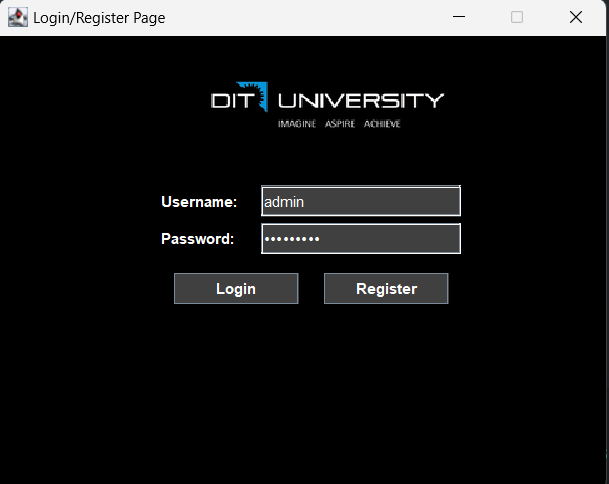
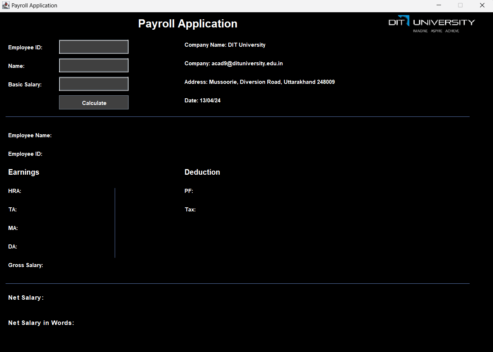
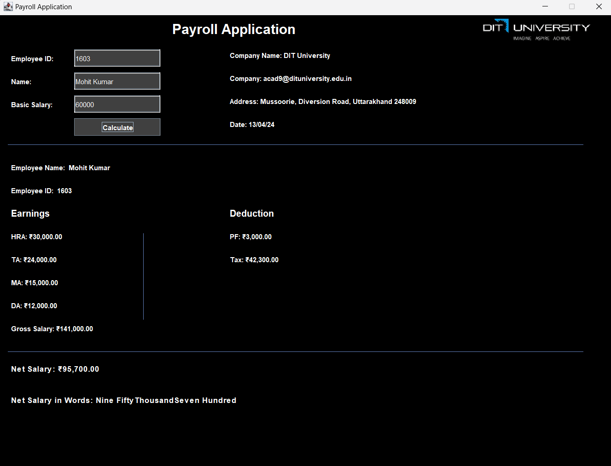

<!DOCTYPE html>
<html lang="en">
<head>
    <meta charset="UTF-8">
    <meta name="viewport" content="width=device-width, initial-scale=1.0">
    <title>Payroll Application GUI</title>
</head>
<body>

<h1>Payroll Application GUI</h1>

This is a Java Swing application that provides a graphical user interface for a payroll system.

<h2>Overview</h2>

The Payroll Application GUI allows users to input employee details such as ID, name, and basic salary. It then calculates the gross salary, deductions, taxes, and net salary based on predefined formulas. The application also displays the net salary in words.

<h2>Features</h2>

<ul>
    <li>Input fields for employee ID, name, and basic salary.</li>
    <li>Calculation of gross salary, deductions, taxes, and net salary.</li>
    <li>Display of net salary in words.</li>
    <li>Pre-filled company information.</li>
    <li>Responsive layout with a modern design.</li>
</ul>

<h2>Screenshots</h2>

<h2>Getting Started</h2>

To run the Payroll Application GUI:

<ol>
    <li>Ensure you have Java installed on your system.</li>
    <li>Clone this repository to your local machine.</li>
    <li>Compile the Java source code.</li>
    <li>Run the compiled Java class file.</li>
</ol>

<pre><code>
javac PayrollApplicationGUI.java
java PayrollApplicationGUI
</code></pre>

<h2>Usage</h2>

<ul>
    <li>Enter The Employee details in the input fields.</li>
    <li>Click the "Calculate" button to compute the salary.</li>
    <li>View the calculated salary details on the screen.</li>
</ul>

<h2>Contributing</h2>

Contributions are welcome! Please feel free to open issues or submit pull requests.

<h2>License</h2>

This project is licensed under the <a href="LICENSE">MIT License</a>.

</body>
</html>
